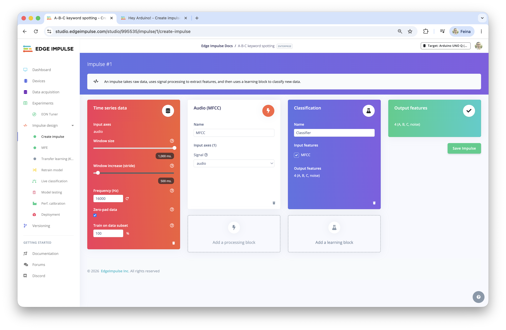
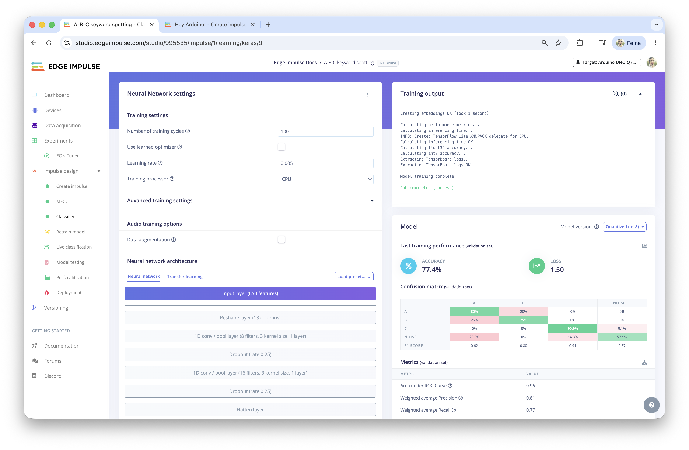
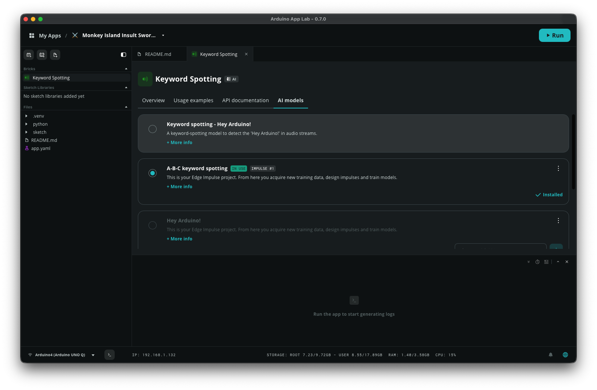

# Monkey Island Insult Sword Fight

## Arduino UNO Q + Edge Impulse + App Lab

When I was a child I enjoyed playing with `The Secret of Monkey Island` graphic adventure. I was a bit nostalgic and I wanted to run some more sword fights with the sword masters, who were really good on insulting. This is why I built a voice-controlled insult sword fighting game inspired by The Secret of Monkey Island, running on Arduino UNO Q with Edge Impulse keyword spotting and a USB webcam with microphone.

The Sword Master throws insults at you. Speak **A**, **B**, or **C** into the microphone to choose your comeback. Three correct answers and you win the duel!

## Prerequisites

### Hardware

- Arduino UNO Q (2GB or 4GB)
- USB webcam with microphone connected to the Arduino UNO Q USB Hub
- Arduino App Lab 0.7+ installed on your computer

### Edge Impulse: Train the A/B/C keyword spotting model

1. [Clone this project](https://studio.edgeimpulse.com/public/995535/live) from Edge Impulse.
2. **Data Acquisition** — collect audio samples:
   - **Class "A"**: Record yourself saying "A" clearly, 30+ samples, 1 second each
   - **Class "B"**: Record "B", 30+ samples
   - **Class "C"**: Record "C", 30+ samples
   - **Class "noise"**: Record 30+ seconds of background noise, split into 1-sec samples
   - **Class "unknown"**: Record random words that are NOT A/B/C, 20+ samples

3. **Impulse Design**:
   - Input: Time series, 1000ms window, 500ms increase
   - Processing: Audio (MFCC)
   - Learning: Classification (Keras)
4. **Train**: 100 cycles, learning rate 0.005

5. **Deployment**:
   - Select **Arduino UNO Q** as target
   - Click **Build**
   - Click **Go to Arduino**
6. In App Lab, the model will appear in the keyword_spotting brick's AI models list

## Deploy to Arduino UNO Q

1. Clone the application from this Github repository into your computer or directly to your Arduino UNO Q
2. Copy the files if you cloned into your computer.
3. Modify the model from the **keyword_spotting** brick
4. In the keyword_spotting brick, go to AI models, download your A/B/C model
5. In Brick Configuration, select the custom model and save
6. SSH the device and install the dependencies: `pip install -r python/requirements.txt`
7. Go back to the Arduino App Lab application
8. Click **Run**
9. Open a browser to `http://<UNO_Q_IP>:5001` to play!

## The game mechanics

- The Sword Master presents an insult (from the original game)
- Three comeback options are shown (A, B, C) — only one is the correct response
- **Click** the option in the browser, **press A/B/C** on keyboard, or **speak** into the microphone.
- **First to 3 correct answers wins** (either you or the Sword Master)
- 5 rounds are randomly selected per fight from 16 total insult/comeback pairs
- The LED matrix on the UNO Q shows animations for each game event

If the model doesn't recognize A, B and C well, re-train the model with your own voice :)

## Credits

- Insults from **The Secret of Monkey Island** by LucasArts (1990)
- Game design by Ron Gilbert, Dave Grossman, and Tim Schafer
- Built with Edge Impulse, Arduino App Lab, and Arduino UNO Q

## Disclaimer 

Use responsibly. Do not use this code in production. Have fun!

